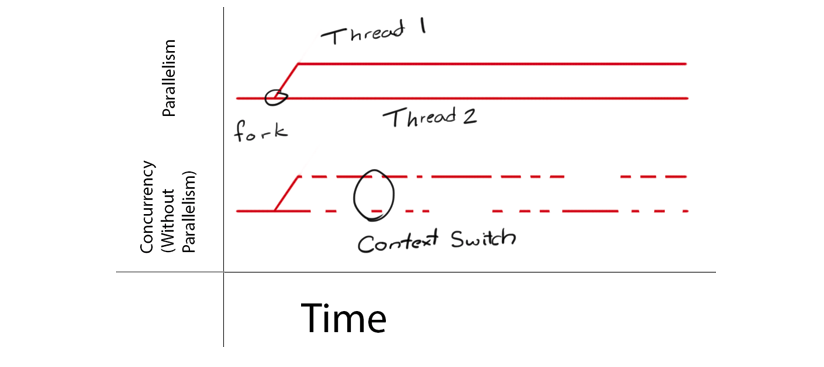

# 1. Thread

### 1.1 Thread Status
* 객체 생성
  * NEW
* 실행 대기
  * RUNNABLE
* 일시 정지
  * WAITING - wait(), join(), sleep()
  * TIMED_WAITING - wait(), join(), sleep() WAITING 상태와의 차이점은 외부적인 변화뿐 아니라 시간에 의해서도 WAITING 상태가 해제 될 수 있다
  * BLOCKED - monitor를 획득하기 위해 다른 스레드가 락을 해제하기를 기다리는 상태(스레드 동기화와 관련)
* 실행
  * RUN
* 종료
  * TERMINATED

### 1.2 Thread 구현 방법
1. Thread 상속
   1. start() 메서드 호출 가능
~~~java
ThreadA threadA = new ThreadA(sumB);
threadA.start();

Thread.sleep(5000);
assertThat(threadA.getSumB(), is(55));

class RunnableA implements Runnable {
    int sumC = 0;

    public RunnableA(int sumC) {
        this.sumC = sumC;
    }

    @Override
    public void run() {
        int i = 0;
        while (i < 10) {
            try {
                i++;
                sumC += i;
                Thread.sleep(100);
            } catch (InterruptedException e) {
                e.printStackTrace();
            }
        }
    }
}
~~~

2. Runnable 구현한 뒤, Thread 객체 생성
    1. start() 메서드 호출 불가능, 반드시 Thread 객체에 담아서 사용
~~~java
RunnableA runnableA = new RunnableA(sumC);
Thread threadWithRunnable = new Thread(runnableA);
threadWithRunnable.start();

Thread.sleep(5000);
assertThat(runnableA.getSumC(), is(55));

class ThreadA extends Thread {
    public int sumB = 0;

    public ThreadA(int sumB) {
        this.sumB = sumB;
    }

    @Override
    public void run() {
        int i = 0;
        while (i < 10) {
            try {
                i++;
                sumB += i;
                Thread.sleep(100);
            } catch (InterruptedException e) {
                e.printStackTrace();
            }
        }
    }
}
~~~

3. Lambda를 사용하여 runnable 구현
~~~java
new Thread(() -> {
    for (int i = 0; i < 10; i++){
        try {
            sumA += i;
            System.out.println(sumA);
            Thread.sleep(100);
        } catch (InterruptedException e) {
            e.printStackTrace();
        }
    }
}).start();
Thread.sleep(5000);
assertThat(sumA, is(45));
~~~

### 1.3 start()와 run()의 차이점?

* start() : New 상태 -> Runnable 상태 (실행 가능한 대기 큐에 들어간 것을 의미한다.)
					메타 정보를 넣고 run()한다.

* run() :  메타 정보를 넣지 않고 run()한다. 제대로된 thread 정보를 가져오지 못할 수 도 있다.

> run()은 단순히 메소드를 실행하는 것이고(싱글스레드), start()는 스택을 만들고 스택안에서 run()하는 것이다.(멀티스레드)

### 1.4 Callable<V> 과 Runnable의 차이점?
둘 다 구현된 함수를 수행한다는 공통점이 있지만 다음과 같은 차이점이 있다.

* Callable : 특정 타입의 객체를 리턴한다. (null일 수도) Exception을 발생시킬 수 도 있다.
	- 구현 메소드 : call()
	- Thread에 인자로 전달 될 수 없다. => ExecutorService 객체에 submit() 메소드를 사용하여 전달한다. (스레드 풀을 사용)
JAVA 1.5 이후

* Runnable : 어떤 객체도 리턴하지 않는다. Exception을 발생시키지 않는다.
	- 구현 메소드 : run()
	- Thread에 인자로 전달되어 사용된다.
JAVA 1.0 이후

# 2. Concurrency 와 Parallelism

### 2.1 Concurrency
* Single CPU로도 구현 가능하다.
* 여러 Thread가 동일한 CPU 자원에 대한 할당/반환 작업을 반복(Context Switching)해서 마치 동시에 작업을 처리하는 것과 비슷한 효과를 보인다.
* 동일한 자원 내에서의 성능 개선을 위해

### 2.2 Parallelism
* 병렬로 작업할 수 있는 Process 단위(OS로부터 독립된 자원을 할당 받음)로 분할하여 작업
* 반드시 2개 이상의 CPU 자원이 필요하다.
* 자원을 늘림으로써 그에 맞는 작업 처리량 개선을 위해

> 즉 Concurrency 와 Parallelism 은 의존 관계가 아니며 명백히 다른 의미를 지니고 있다. 둘의 단순 성능 비교는 의미가 없다. 따라서 구성하려는 시스템의 성향에 따라 적절하게 사용하면 된다.

> 참조 <https://vallista.kr/2019/12/28/%EB%8F%99%EC%8B%9C%EC%84%B1%EA%B3%BC-%EB%B3%91%EB%A0%AC%EC%84%B1-Concurrency-Parallelism/>