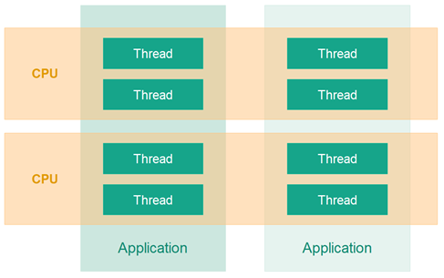

# Java Concurrency

Java Concurrency는 Java 플랫폼에서의 멀티스레딩, 동시성 및 병렬 처리를 다루는 용어이다.

Java Concurrency Tutorial에서는 멀티스레딩, 동시성 구성, 동시성 문제점, 비용 등 Java 멀티스레딩 관련 이점의 핵심 개념을 다룰 것이다.

# 1. What is MultiThreading?

멀티스레딩은 동일한 응용 프로그램 내에 여러 실행 스레드가 있음을 의미한다.

스레드는 응용 프로그램을 실행하는 별도의 CPU와 같다. 따라서 다중 스레드 응용 프로그램은 여러 CPU가 동시에 코드의 다른 부분을 실행하는 응용 프로그램과 같다.

단, 스레드는 CPU와 같지는 않다. 일반적으로 단일 CPU는 여러 스레드간에 실행 시간을 공유하여 지정된 시간동안 각 스레드 간에 전환이 일어나며, 응용 프로그램의 스레드가 다른 CPU에 의해 실행되도록 할 수 있다.

# 2. Why Multithreading?

응용 프로그램에서 멀티스레딩을 사용하는 것은 아래와 같은 이유들이 있다.

   * 단일 CPU 사용률 향상
   * 여러 CPU 또는 CPU 코어 사용률 향상
   * 응답성과 관련하여 더 나은 사용자 경험
   * 공정성과 관련하여 더 나은 사용자 경험

## 2.1 단일 CPU 사용률 향상
가장 일반적인 이유 중 하나는 컴퓨터의 리소스를 더 잘 활용할 수 있기 때문이다. 예를 들어, 한 스레드가 네트워크를 통해 전송된 요청에 대한 응답을 기다리는 경우 다른 스레드가 그동안 CPU를 사용하여 다른 작업을 수행할 수 있다.

## 2.2 여러 CPU 또는 CPU 코어 사용률 향상
컴퓨터에 여러개의 CPU가 있거나 CPU에 여러개의 실행 코어가 있는 경우 모든 CPU 또는 CPU 코어를 활용하려면 응용 프로그램에 여러개의 스레드를 사용해야 한다.

## 2.3 응답성과 관련하여 더 나은 사용자 경험
한 스레드는 사용자의 응답을 처리하고 또 다른 스레드는 백그라운드에 의해 다른 요청을 처리함으로써 응답 속도를 향상할 수 있다.

## 2.4 공정성과 관련하여 더 나은 사용자 경험
싱글 스레드 환경이라면 클라이언트가 처리하는데 시간이 오래 걸리는 요청을 보내면 다른 모든 요청은 해당 요청이 완료될 때까지 기다려야한다. 이를 멀티스레딩을 이용하면 각 클라이언트의 요청을 자체 스레드로 실행하도록 구성하고 그로인해 단일 작업으로 CPU를 독점하지 않게 된다.

# 3. MultiThreading vs MultiTasking

|       |     멀티 태스킹      |        멀티 스레딩        |
| :---: | :-------------: | :------------------: |
|  기능   |     OS의 기능      |       프로세스의 기능       |
|  실행   | 여러 프로세스가 동시에 실행 | 단일 프로세스에서 여러 스레드의 실행 |
|  자원   | 프로세스 간에 리소스를 공유 |    스레드 간에 리소스를 공유    |

# 4. Risk of Thread

## 4.1 Safety Hazards
다중 스레드 프로그램에서 여러 스레드가 동일한 변수에 대해 값 수정을 할 수 있기 때문에 공유 변수에 대한 제어의 접근을 조정 (동기화) 해햐 한다.

## 4.2 Liveness Hazards
스레드의 생존을 위협하는 많은 경우가 존재하는데 예를 들면 스레드 B가 독점적인 자원을 스레드 A가 대기하고 있을 때, 스레드 B가 자원을 절대 해제하지 않는다면 스레드 A는 영원히 대기해야 한다. 이 때, 프로그램은 deadlock, starvation, livelock 등의 문제가 발생하게 된다.

## 4.3 Performances Hazards
성능 문제는 짧은 서비스 시간, 응답성, 처리량, 리소스 소비 또는 확정성 등 광범위한 문제를 다룬다. 응용 프로그램에서 잘 설계된 스레드를 사용한다면 성능 향상을 가져올 것이다. 그렇지 않다면 context-swiching에서 발생하는 비용(CPU 사용량)이 더 많이 들 수 있다.

# 5. Thread Safety

여러 스레드가 적절한 동기화없이 동일한 변경 가능 상태 변수에 액세스하는 경우 프로그램이 중단된다.

* 스레드간에 상태 변수를 공유하지 않음
* immutable 상태 변수를 만들어써라
* 상태 변수에 액세스 할 때마다 동기화를 사용해라

## 5.1 What is Thread Safety

Thread-safety를 정의하는 것은 매우 까다롭다.

Thread-safety를 정의할 수 있는 가장 가까운 단어는 정확성이다. 멀티스레딩 환경에서도 우리가 설계한대로 프로그램이 동작하고 정확한 결과가 나올 때, Thread-safety 하다고 말 할 수 있다.

> Thread-safe 클래스는 필요한 동기화를 캡슐화하여 클라이언트가 자체적으로 제공할 필요가 없다.

~~~java
@ThreadSafe
public class StatelessFactorizer implements Servlet {
   public void service(ServletRequest req, ServletResponse resp)
   {
      BigInteger i = extractFromRequest(req);
      BigInteger[] factors = factor(i);
      encodeIntoResponse(resp, factors);
   }
}
~~~

> Stateless 객체는 항상 Thread-safety 하다.

## 5.2 Atomicty

~~~java
@NotThreadSafe
public class UnsafeCountingFactorizer implements Servlet {
        private long count = 0;
        public long getCount() {
           return count;
         }

         public void service(ServletRequest req, ServletResponse resp) {
            BigInteger i = extractFromRequest(req);
            BigInteger[] factors = factor(i);
            ++count;
            encodeIntoResponse(resp, factors);
         }
}
~~~

> 가능한 경우 AtomicLong과 같은 기존 스레드로부터 안전한 객체를 사용하여 클래스 상태를 관리해라.

~~~java
@ThreadSafe
public class CountingFactorizer implements Servlet {
      private final AtomicLong count = new AtomicLong(0);
      public long getCount() {
         return count.get();
      }
      public void service(ServletRequest req, ServletResponse resp) {
         BigInteger i = extractFromRequest(req);
         BigInteger[] factors = factor(i);
         count.incrementAndGet();
         encodeIntoResponse(resp, factors);
      }
}
~~~

### 5.2.1 Race Conditions

Race Conditions은 계산의 정확성이 상대 타이밍에 의존할 경우 발생한다.

## 5.3 Locking
Java는 원자성을 강화하기 위해 잠금 메커니즘인 동기화된 블록을 제공한다.

* IntrinsicLocks or Monitor Locks (고유잠금)
   * 동기화된 블록에 들어가기전 내장 잠금을 자동으로 획득하고 블록을 종료할 때 자동으로 해제한다.
* Reentrancy (재진입)
   * 다른 스레드가 보유한 잠금으로의 진입은 차단되지만 고유 잠금은 재진입 가능하다.
   * 잠금은 스레드 당 획득됨을 의미한다.
   * 동일한 스레드가 다시 잠금을 획득하면 카운트가 증가하고 소유 스레드가 동기화된 블록을 종료할 때 카운트가 감소한다. 카운트가 0이 될 때 최종적으로 잠금이 해제된다.

~~~java
synchronized (lock) {
   // Access or modify shared state guarded by lock
}
~~~

AtomicLong vs synchronized(object)

1. Atomic 클래스는 CAS(Compare-and-swap) 방식으로 동작한다.
   * 비교하고 다르면 다시 읽고 비교하고 이를 반복한다.

2. synchronized(object)
   * 하나의 스레드가 lock을 얻고 나서 작업이 끝날 때까지 다른 스레드들은 대기한다.

> synchronized 보다 Atomic 클래스 객체를 사용하는 것이 성능이나 비용면에서 유리하다.

## 5.4 Guarding State with Locks

## 5.5 Liveness and Performance

> 참조 <http://tutorials.jenkov.com/java-concurrency/index.html>